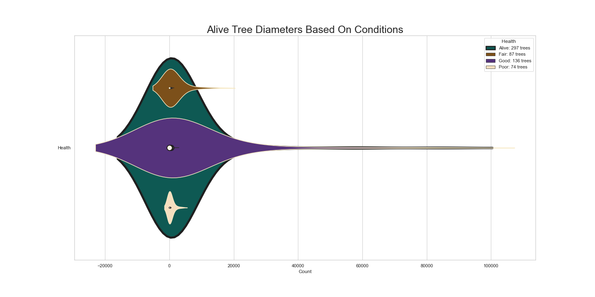
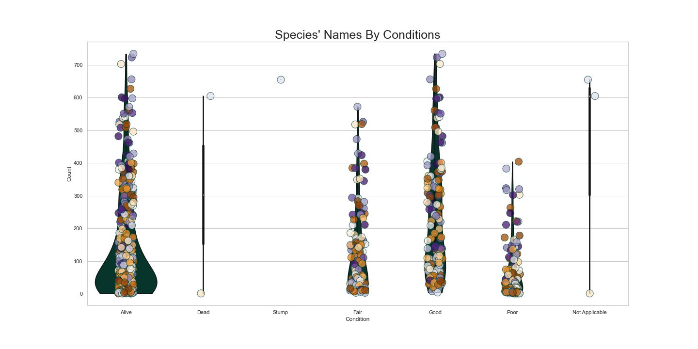

# New York 2015 Street Trees Census

  
 

<!-- toc -->

# Introduction

I recently came across this project through a YouTuber, Mısra Turp, and was inspired to expound upon the project using my own skills. I am conducting an Exploratory Data Analysis (EDA) on a dataset collected by the NYC Parks & Recreation and partner organizations. The dataset consists of tree species, diameter, and perception of health of trees organized by staff and volunteers. My goal is to understand the distribution of tree species, diameter, and health perception across New York City. Through this EDA, I hope to gain insights that can be used to guide decision-making and improve the management of trees in the city. I would like to thank Mısra Turp for providing me with this project.

 

# Data Exploration

I successfully stored and secured the street tree data from TreeCount! which is owned by NYC Open Data. The data was created and made available to the public on June 3, 2016 and was last updated on October 4, 2017. The data consists of 684K rows, 45 columns, and each row is a detailed record of a tree. The feature columns explored are:

| Column       | Description   | Type   | Relabeled |
| ------------- |:-------------:|:-----:|     -----:|
| tree_id      | Unique identification number for each tree point | Integer | **Tree_Id** |
| tree_dbh      | Tree diameter, ≈ 54in / 137cm above the ground | Float | **Tree_Dbh_in** |
| stump_diam    | Stump diameter rounded to the nearest (inch) | Float | **Stump_Diam_in** |
| curb_loc      | Location of tree bed in relationship to the curb | String | **Curb_Loc** |
| status    | Indicates whether the tree is alive, standing dead, or a stump | String  | **Status** |
| health        | Indicates the user's perception of tree health | String | **Health** |
| created_at    | Date when records were done | String | **Created_At** |
| spc_latin     | Scientific name for species, e.g. "Acer rubrum" | String | **Spc_Latin** |
| steward       | Unique signs of stewardship observed | String | **Steward** |
| sidewalk       | Indicates flags adjacent to if tree was damaged, cracked, or lifted | Integer | **Sidewalk** |
| problems  | Indicate tree problems | String  | **Problems** |
| root_stone | Root problem caused by paving stones in tree bed | Boolean | **Root_Stone** |
| root_grate | Root problem caused by metal grates in tree bed | Boolean | **Root_Grate** |
| root_other    | Indicates the presence of other root problems | Boolean | **Root_Other** |
| trunk_wire    | Trunk problem caused by wires or rope encircling the trunk | Boolean | **Trunk_Wire** |
| trnk_light    | Trunk problem caused by lighting installed on the tree | Boolean | **Trnk_Light** |
| trnk_other | Indicates the presence of other trunk problems | Boolean | **Trnk_Other** |
| brch_light    | Branch problem caused by lights (usually string lights) or wires | Boolean | **Brch_Light** |
| brch_shoe    | Branch problem caused by sneakers in the branches | Boolean | **Brch_Shoe** |
| brch_other    | Indicates the presence of other branch problems | Boolean | **Brch_Other** |

 
 

# Data Visualization

  

 
 

# Data Analysis

The data analysis above provides several key insights into the condition and management of street trees in the area. First, the distribution of tree diameters is concentrated between 50-60 inches, but there are a significant number of outliers that may be due to human error or environmental impacts. This suggests that there may be some issues with data collection or other external factors affecting tree growth and development.

Second, the mean diameter at breast height for street trees is 11.28 inches, with a median of 9 inches, indicating a relatively wide range of tree sizes. The large standard deviation of 20 further emphasizes the variability in tree size across the area. Additionally, the median tree diameter of 12 inches is much higher than the median stump diameter of 3 inches, indicating that the trees in the area are generally larger and older than their stumps.

Third, the survey responses show that the majority of workers reported 0-2 problems with street trees, with more variance in responses reporting higher numbers of problems. This suggests that there may be some issues with the roots of the trees that are affecting their health and vitality.

Fourth, while the majority of trees in the area are in good health and labeled as "Alive", there is a need for improvement in the management and care of trees in "Fair" and "Poor" condition. The data suggests that there may be some issues with the roots of these trees that need to be addressed to ensure their survival and long-term health.

Finally, the diameters in the Not Applicable category are more tightly clustered than in the Stump category, indicating that there may be more consistency in this area of data collection. However, bins with maximum outliers suggest potential data errors or other issues that need to be addressed.

Overall, this data analysis provides valuable insights into the condition of street trees in the area and highlights areas that may need additional attention and resources to ensure the health and vitality of these important urban assets.

 

# Conclusion

The comprehensive street tree census carried out by NYC Parks & Recreation and partner organizations in 2015 offers crucial insights into the state of street trees in the area.

Although the majority of street trees are healthy, the findings emphasize the need for improving and maintaining trees in "Fair" and "Poor" condition. The data analysis also highlights potential root issues and variations in tree diameter measurements compared to stump diameter measurements. Further research can be conducted to investigate the underlying causes of these discrepancies, and to establish effective strategies for managing and caring for street trees in the area.

